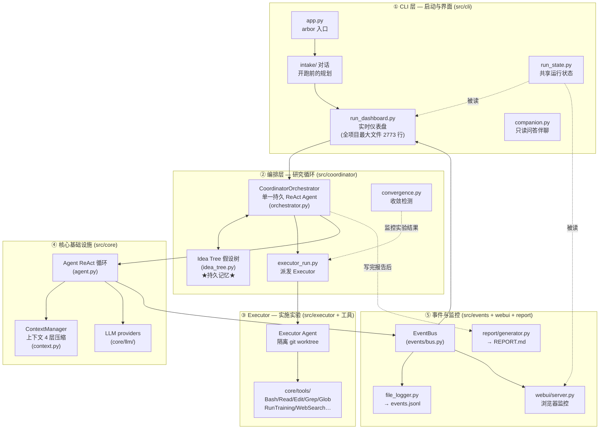
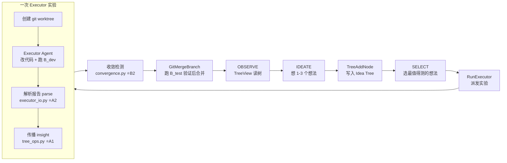
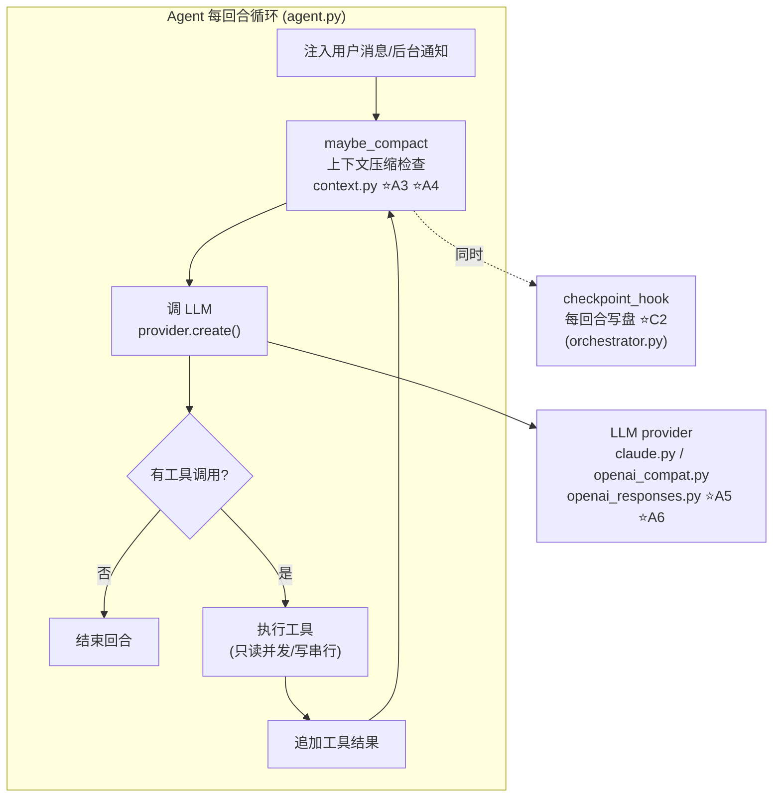
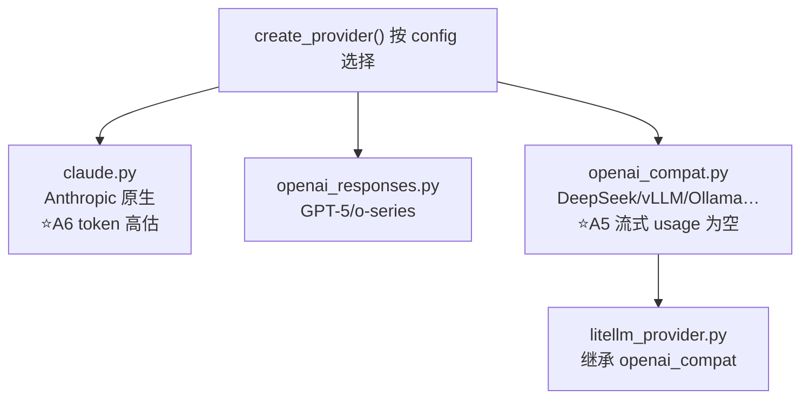
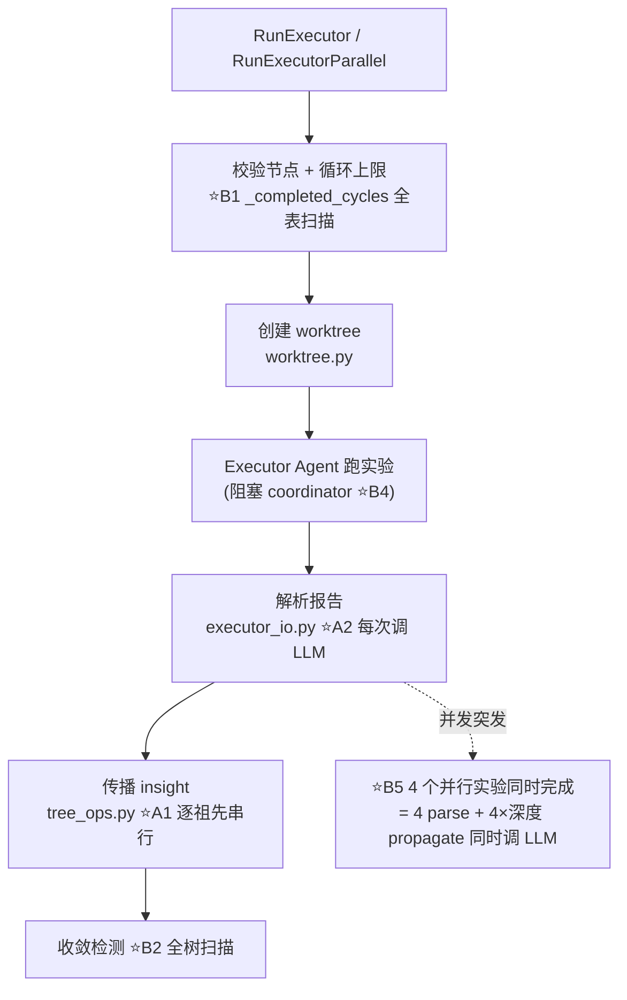
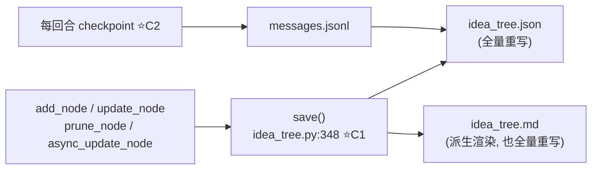
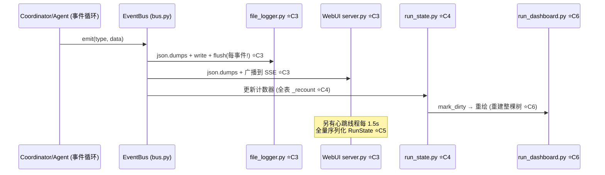

# Arbor 项目架构与优化点地图

> 这份文档用流程图把整个项目讲清楚，并把每个优化点**钉在它所在的位置**上。
> 配合 `OPTIMIZATION_FINDINGS.md`（纯优化清单）阅读；这里更侧重"它在哪、为什么、改它影响什么"。
> 所有路径相对 `src/` 根目录。

---

## 0. 先理解 Arbor 是什么

Arbor 是一个**自主研究智能体**：给它一个基准和一个目标，它自己提假设、改代码、跑实验、保留有收益的改动——整个过程形成一棵"假设树"。

它的核心机制可以浓缩成一句话：

> **一个 Coordinator（研究主管）反复做「观察→提想法→派活→收结果→总结→决策」六步循环；每次派活都让一个 Executor（研究工程师）在隔离的 git worktree 里真正改代码、跑实验。**

所以整个项目本质上是**一条 ReAct 工具调用循环**（Coordinator 的 LLM 每轮决定下一步调哪个工具）+ **一套围绕它的持久化/监控/隔离基础设施**。

---

## 1. 顶层架构图（整个项目全貌）

**读图顺序**：用户在 `① CLI` 里启动 → 进入 `② Coordinator` 的循环 → 派 `③ Executor` 用 `④ 核心工具` 干活 → 整个过程通过 `⑤ 事件总线` 广播给仪表盘/浏览器/日志。

---

## 2. 一次 arbor cycle 的数据流（优化点最集中的地方）

Coordinator 的循环不是自己实现的循环控制，而是**靠一条 ReAct 循环里调工具**驱动的。下面是完整的一次实验周期，⭐ 标了优化点所在环节：

- ⭐A1：`propagate_insights` **逐祖先串行调 LLM**（父→根每个都调一次）
- ⭐A2：`_parse_executor_report` **每个实验都调一次 LLM** 解析报告
- ⭐B2：`convergence._rebuild_state` 每次实验完成都**全树扫描排序**

这三个点都发生在"**每做完一个实验**"这个最频繁的路径上，所以它们属于最高收益优化。

---

## 3. ReAct 循环内部（agent.py + context.py）

Coordinator 和 Executor 用的其实是**同一个 `Agent` 类**（`core/agent.py`），跑同一条 ReAct 循环。这条循环是整台机器的引擎，每一步都在上面发生：

### ⭐A3 — 上下文压缩破坏缓存（`agent.py:317` + `context.py`）
- **位置**：循环第 1 步 `maybe_compact`。
- **知识点**：LLM 对话是按"前缀缓存"计费的——Anthropic/OpenAI 都缓存你发过的一段前缀，下次相同前缀只收 1/5 的费用。Arbor 把缓存断点标在**最后一条消息**上，靠"每次只新增一点点"来持续命中缓存。
- **问题**：`maybe_compact` 压缩时会**就地改写旧消息**（截断、摘除、去重），一改，缓存断点就失效了——下一轮整个前缀重新按原价上传。
- **优化**：压缩时主动失效/移动断点，或只压缩断点之前的消息。**保住的是一次 run 全程约 5 倍的缓存读取成本**。

### ⭐A4 — token 估算每回合全量扫描（`context.py:58-76`）
- **位置**：循环第 1 步，`maybe_compact` 里判断"要不要压缩"。
- **知识点**：LLM API 按 token 计费，客户端必须知道当前上下文多大才能决定要不要压缩。Arbor 用 tiktoken 逐块编码估算。
- **问题**：每次调用前都**线性扫描全部消息**、逐块 `tiktoken.encode()`。200+ 条消息时每回合 O(N)，且反复算同一批消息。
- **优化**：消息 dict 里缓存估算值（`_est_tokens`），追加时增量更新、压缩时失效。每回合省掉一次 O(N) 扫描。

### ⭐C2 — checkpoint 每回合都写盘（`orchestrator.py:639`）
- **位置**：循环外，`AgentConfig.checkpoint_hook` 挂在每回合结束时。
- **知识点**：checkpoint 是"崩溃续跑"的保险——写 messages.jsonl（追加）+ checkpoint.json（覆盖）。树本身独立持久化，所以就算丢了消息历史，树还在。
- **问题**：300 回合的 run = 300 次写循环。大部分回合之间其实没有关键状态变化。
- **优化**：防抖到每 N 回合，或只在 executor 结果到达时写。**崩溃最多丢几回合上下文，树不受影响**，所以这个保险没必要每回合买。

### ⭐A7 — max_tokens 截断恢复会双倍计费（`agent.py:384-393`）
- **位置**：回合中调 LLM 之后。
- **知识点**：模型输出被 `max_tokens` 截断时，Arbor 追加一条"请继续"的 nudge 再调一次 LLM（最多 3 次）。
- **性质**：这是合理容错（截断不代表模型停下了），但同一回合成本翻倍。**不是 bug**，只是要知道这里有这个代价——调大 `max_tokens` 或减少恢复次数能省钱。

---

## 4. LLM provider 层（core/llm/）

所有 LLM 调用最终都落到这 4 个 provider 之一。自动模式先探测 Responses API，Claude 走 Anthropic 原生 API，其余走 OpenAI 兼容（DeepSeek/vLLM/Ollama 都在这条路）：

### ⭐A5 — 流式路径 usage 为空（`openai_compat.py:236`）
- **位置**：`create_streaming()` 结束时 `Usage()` 留空。
- **知识点**：token 统计（成本、缓存命中率）全靠 provider 返回的 usage。OpenAI 兼容的流式接口在**最后一个 chunk** 里带 usage，但必须显式请求 `stream_options={"include_usage": True}`。
- **问题**：现在流式调用完全丢失 token 和缓存统计 → 仪表盘的 token 计数、run_stats、缓存命中率都不准。
- **优化**：加上该参数并从最后 chunk 提取。

### ⭐A6 — Claude token 计数高估 10-15%（`claude.py:70-74, 179-180`）
- **位置**：`count_tokens()`。
- **知识点**：Anthropic 没有公开的 Python tokenizer，Arbor 用 tiktoken 的 `cl100k_base` 当代理。GPT 系分词器在常见文本上比 Claude 真实分词器**多估 10-15%**。
- **问题**：token 估算偏大 → `maybe_compact` 的阈值（窗口 × 比例）**提前触发压缩**，压缩本身又要花一次 LLM 调用来总结。
- **优化**：按模型族校准估算系数，或缓存估算值（见 A4）。

---

## 5. Executor 派发与隔离（executor_run.py + worktree.py + executor_io.py）

每次"派活"都要：建独立 worktree → 让 Executor 在里面跑 → 解析报告 → 传播 insight。这一段的隔离设计是 Arbor 的卖点（main 永远不被污染），也是优化点扎堆的地方：

### ⭐B1 — `_completed_cycles()` 全表扫描（`executor_run.py:88-98`）
- **位置**：每次派发前的"循环预算"检查。
- **知识点**：每个节点算一个"已消耗的循环"，上限 `max_cycles` 是硬预算。这个计数要能挡住无限派发。
- **问题**：每次检查都**线性扫描所有节点**统计 status。树越来越大就越慢。
- **优化**：维护一个缓存计数器，节点状态迁移时增量 +1/-1。

### ⭐B4 — coordinator 在 Executor 运行期间完全阻塞（`executor_run.py:437-439`）
- **位置**：`wait_for(agent.run())` 那一段。
- **知识点**：Coordinator 和 Executor 在**同一个 asyncio 事件循环**里，Executor 跑多久（10-60 分钟），Coordinator 就干等多久——它没法在这期间提新想法、派搜索代理、处理用户输入。
- **问题**：算力浪费。实验跑的时候主管应该能并行做别的事。
- **优化**：结构性改动——让 Executor 像 SearchAgent（`search_ctx.py` 里已经有的模式）一样**后台跑 + 完成回调**，Coordinator 空窗期做其他事。这是改动最大的一个点，但要清楚它改变的是并发模型。

### ⭐B3 — `RunExecutorParallel` 用 `gather` 阻塞到全部完成（`executor_run.py:1113`）
- **位置**：并行派发的收尾。
- **知识点**：`asyncio.gather` 要等**所有**协程完成才返回。4 个并行实验里 1 个跑 60 分钟，另外 3 个 5 分钟就完了，Coordinator 还是得等 60 分钟。
- **优化**：改 `asyncio.as_completed`，**谁先完成先处理谁**，Coordinator 能尽早看到结果，甚至中途裁剪还在跑的。

### ⭐B5 — 并行实验完成时突发 LLM 调用
- **位置**：`executor_run.py:1113` + `executor_io.py:238` + `tree_ops.py:600` 的组合。
- **知识点**：4 个 Executor 同时完成后，A1 + A2 的 LLM 调用会在**一瞬间**同时爆发（最多 4 + 4×深度 次），可能撞 provider 限流（429）。
- **优化**：给 parse/propagate 加 semaphore 限流（如最多 2 并发）。

### ⭐B6 — eval_info 在每个 Executor 提示词里重复注入（`executor_io.py:54-98`）
- **位置**：构建 Executor 的用户消息时。
- **知识点**：baseline/trunk/dataset 这些字段对同一个 run 的**所有** Executor 是完全一样的，但被拼进了**每个** Executor 的用户消息，20 个实验就重复 20 次。
- **优化**：静态字段放进 Executor 的 system prompt（只构建一次），用户消息只留模板替换后的命令。

---

## 6. 持久化：Idea Tree + checkpoint

Idea Tree 是**唯一的持久记忆**——上下文压缩、进程崩溃都不丢它，因为它每次改动都落盘：

### ⭐C1 — `save()` 每次 mutation 同步双写 JSON + MD（`idea_tree.py:348-356`）
- **位置**：树的每一个写操作后面。
- **知识点**：JSON 是规范存储（恢复用），Markdown 是给人看的派生渲染。两者都由 `_atomic_write`（临时文件 + rename）保证崩溃安全。
- **问题**：每个 `add_node`/`update_node` 都**全量重写两个文件**，无防抖。IDEATE 一轮提 3-5 个想法 = 6-10 次写。而且同步版 `add_node`/`update_node` 不拿 `_save_lock`，与 `async_update_node` 不一致，**并行 executor 场景有并发竞态**。
- **优化**：MD 防抖写（每 N 次或定时），JSON 保持即时写保崩溃安全；统一所有 mutation 走锁。

---

## 7. 事件管道与监控（events/ + run_state/ + dashboard + webui）

整个系统是**事件驱动**的：Coordinator/Executor 每有动静就 `bus.emit`，仪表盘、浏览器、日志、统计都是事件的订阅者。这条管道的瓶颈在于"每个事件都要同步过一遍所有订阅者"：

### ⭐C3 — 事件管道同步阻塞事件循环（`file_logger.py:42-43` + `webui/server.py:200` + `bus.py:68`）
- **位置**：每一个 `emit()`。
- **知识点**：`emit()` 是"fire-and-forget"，但**同步订阅者是在调用者（事件循环）的线程里内联执行的**。每次 emit，file_logger 做一次 `json.dumps` + **每事件一次 `flush()`**（几千个事件 = 几千次 syscall），WebUI 再 `json.dumps` 一次并广播。
- **问题**：这些磁盘 I/O + 序列化**全部阻塞在 orchestrator 的 asyncio 事件循环上**。THINKING_DELTA 这种高频流式事件尤其疼。
- **优化**：日志挪到**独立写线程 + 队列**，`flush()` 改成周期性的（如每 200ms 或每 N 事件）。这是监控层最高性价比的优化。

### ⭐C4 — `run_state._recount()` 每次状态变化全表扫描（`run_state.py:679-691`）
- **位置**：每个 idea 状态事件（completed/pruned/merged/executor_start/end）。
- **知识点**：仪表盘顶部要显示"running/done/pruned/merged"几个计数，`_recount` 从零重算。
- **问题**：每个事件都遍历**所有 ideas**，O(n)/事件，200+ 节点时浪费。
- **优化**：增量维护 delta（旧状态 -1、新状态 +1）。

### ⭐C5 — WebUI 快照每 1.5s 全量序列化（`webui/server.py:206-212` + `snapshot.py:96-178`）
- **位置**：WebUI 的心跳线程。
- **知识点**：浏览器监控靠"每 1.5s 推一帧完整状态快照"。
- **问题**：每帧都深拷贝整个 RunState（idea ledger、thinking_feed、activity）再 json.dumps。树大了以后 CPU 开销可观。
- **优化**：缓存快照，仅当 state dirty 时重算；或改 SSE 增量推送。

### ⭐C6 — dashboard 每次重绘重建整棵树（`run_dashboard.py:1829-1896`）
- **位置**：仪表盘每次 paint（最多 2.5/sec）。
- **知识点**：仪表盘每帧都从 idea ledger 重建 children 映射、递归渲染整棵假设树。
- **问题**：树没变时也在重复劳动。
- **优化**：以（idea 数, 最后修改 id）为 key 缓存渲染结果，跳过未变化的帧。

---

## 8. 工具层（core/tools/）

Executor 在 worktree 里的每一件事都经这里。工具层的优化多数是"少做无用功"：

| 优化点 | 位置 | 知识点 | 问题 | 建议 |
|--------|------|--------|------|------|
| ⭐D1 | `glob_tool.py:95` | 结果要按 mtime 排序 | 每个匹配文件一次 `p.stat()`，上万文件 = 上万次 syscall | 用 `os.scandir()` 拿缓存 stat |
| ⭐D2 | `grep.py:122` | 优先用 ripgrep | **每次执行**都 `shutil.which("rg")` 找路径 | 在 `__init__` 缓存一次 |
| ⭐D3 | `file_edit.py:192-193` | 编辑 = 读全文件→替换→写全文件 | 写入非原子，中途崩溃留截断文件 | 临时文件 + `os.replace()` |
| ⭐D4 | `file_read.py:137,176` | 大结果应持久化到磁盘再给预览 | PDF/notebook 直接 `_truncate` 硬截断 | 改走 `process_result()` |
| D7 | `git_ops.py:47` | 用 `create_subprocess_shell` 拼字符串 | 配置值可能注入 shell | 改 `create_subprocess_exec` |
| D8 | `worktree.py:42` | 分支名 hash | SHA-1 非加密场景浪费 | 用 `blake2b`/`md5` |

---

## 9. 代码质量 / 小瑕疵（已确认的快速修复）

| 优化点 | 位置 | 说明 |
|--------|------|------|
| ⭐D5 | `coordinator/main.py:133-140` | **`yaml` 和 `redacted_snapshot` 被 import 了两次**（copy-paste 残留），删掉重复块即可，零风险 |
| D6 | `executor/main.py:24` / `orchestrator.py:225` / `coordinator/main.py:60` | `_ensure_gitignore` 三处近乎相同的实现，合并到 `core/` |
| D9 | `recall.py:43-50` | 经验召回用纯关键词 Jaccard 匹配，脆弱；`list_experiences` 按字母序而非时间序排序 |
| D10 | `export.py:143-238` | 导出把整个会话（可能数百 MB）一次性读进内存再 base64 进 HTML |

---

## 10. 一张总表：按"在哪个环节"归纳

| 环节 | 优化点 | 核心收益 |
|------|--------|---------|
| **ReAct 循环** | A3 缓存失效、A4 token 扫描、A7 截断恢复 | 每回合省成本 |
| **LLM provider** | A5 流式 usage、A6 token 高估 | 统计准确 + 压缩时机更准 |
| **Coordinator 编排** | B1 循环计数、B3 gather→as_completed、B4 后台 executor、B5 突发限流 | 更快拿到结果、不空转 |
| **Executor 生命周期** | A1 传播串行、A2 解析冗余、B6 提示词重复 | 每实验省 3~N 次 LLM 调用 |
| **收敛检测** | B2 全树扫描 | 消除每实验的 O(n log n) |
| **持久化** | C1 双写防抖、C2 checkpoint 防抖 | 少写盘、修并发竞态 |
| **事件/监控** | C3 事件阻塞、C4 _recount、C5 快照、C6 重绘 | 事件循环不再被 I/O 卡住 |
| **工具层** | D1-D4、D7、D8 | 少做无用功 |
| **代码质量** | D5-D6、D9、D10 | 可立即清理 |

**优先级排序建议**（低成本高收益优先）：
1. **D5**（重复导入）— 2 分钟修掉，零风险
2. **A1+A2**（每实验省 LLM 调用）— 成本影响最大
3. **C3**（事件管道移线程）— 监控层最大的卡点
4. **B1+B2**（增量计数/收敛）— 消除全树扫描热点
5. **A3**（缓存感知压缩）— 保全程缓存收益
6. **A4**（增量 token 估算）— 每回合省 O(N)

> 注意：A1/B4/C2 这几个涉及行为/并发模型/崩溃恢复粒度的变更，实施前要逐个确认副作用。其余多为**局部、可回滚**的优化。
